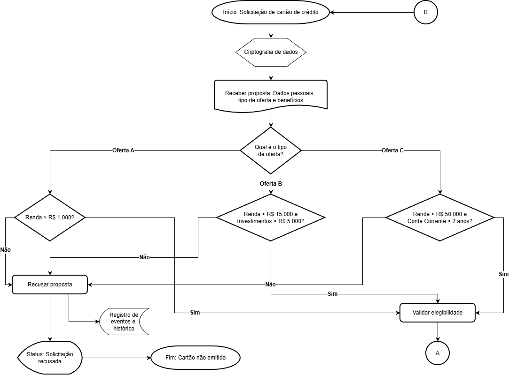
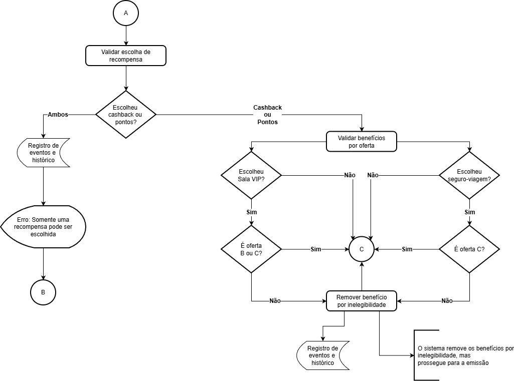
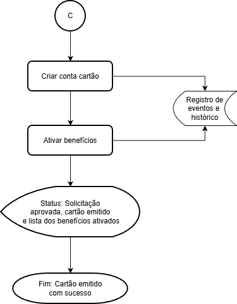

# Teste técnico: DomvsIT

## Enunciado

### Escopo

Projete, em nível de arquitetura (fluxograma ou algum diagrama de sua escolha), um fluxo para solicitação de cartão de crédito, no qual o usuário possa escolher os benefícios durante a jornada. Existem critérios de elegibilidade tanto para a oferta do cartão quanto para a escolha dos benefícios.

Temos 3 ofertas de cartão:
- **Oferta A:** renda acima de R$ 1.000;
- **Oferta B:** renda acima de R$ 15.000 e investimentos maiores que R$ 5.000;
- **Oferta C:** renda acima de R$ 50.000 e conta corrente com mais de 2 anos.

Benefícios disponíveis _(com regras de elegibilidade)_:
- **Cashback:** caso escolha pontos, não será possível ter cashback;
- **Pontos:** caso escolha cashback, não será possível ter pontos;
- **Seguro-viagem:** apenas para a oferta C;
- **Sala VIP:** apenas para as ofertas B e C.

Ao final do fluxo, o cliente deve conseguir visualizar o status da proposta, se o cartão foi criado ou não e quais benefícios foram ativados.

### Requisitos funcionais mínimos/premissas:

- Receber proposta com dados pessoais, tipo de oferta e seleção de benefícios;
- Validar elegibilidade;
- Criar conta cartão _(a conta corrente já existe)_;
- Ativar benefícios elegíveis;
- Comunicar o status ao cliente;
- Registrar eventos e histórico do processo;
- Tratar dados sensíveis com cuidado.

## Fluxograma

### 1. Recepção da proposta e validação da oferta

### 2. Validação de elegibilidade

### 3. Criação da conta e ativação de benefícios elegíveis

